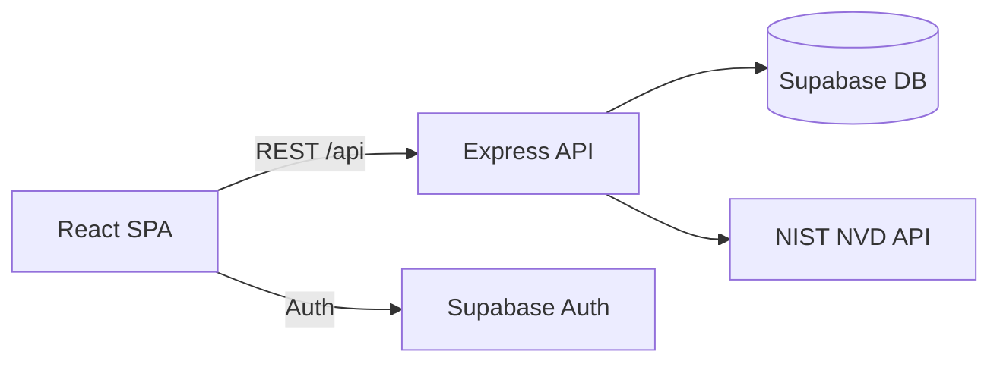
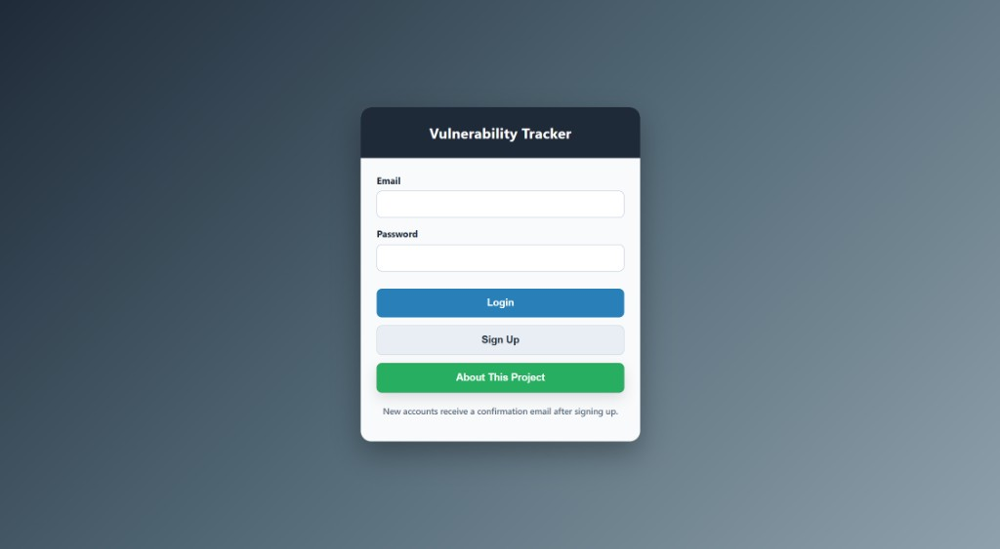
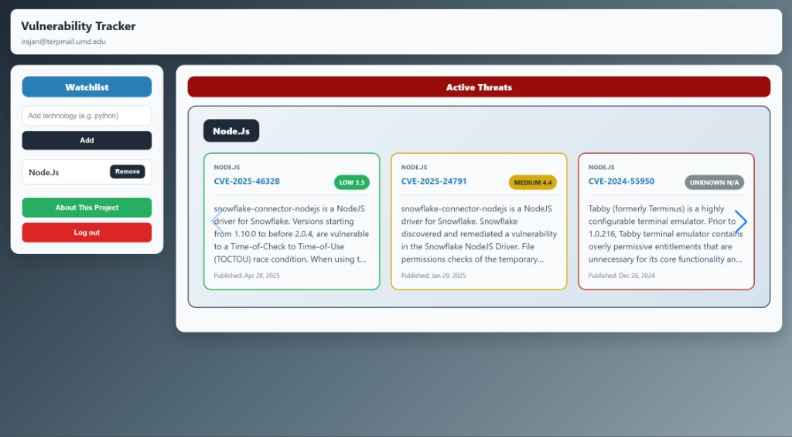
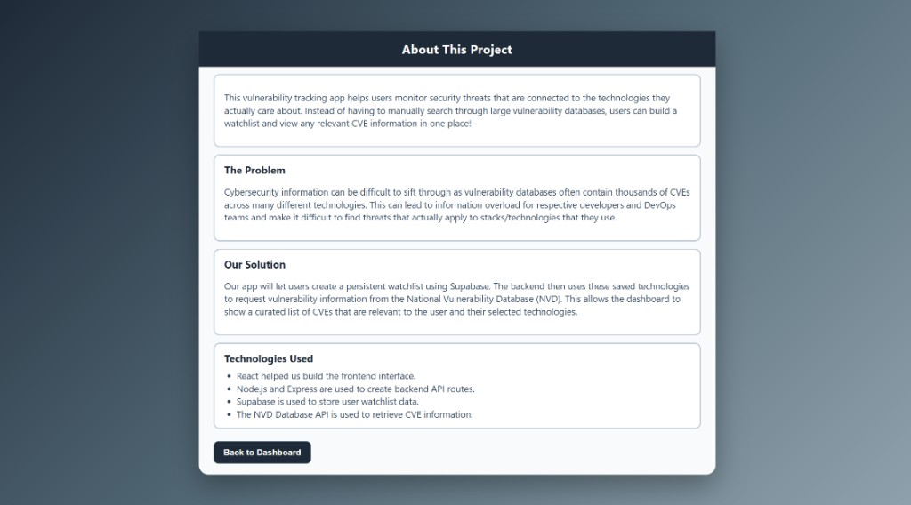

# Vulnerability Tracker

A full-stack web app that helps developers monitor **CVE vulnerabilities** for technologies in their stack. Instead of searching the full [NIST NVD](https://nvd.nist.gov/) manually, you maintain a personal watchlist and browse severity-ranked threats on a dashboard.

**Live demo:** [https://inst-377-project-final-philip-montv.vercel.app/](https://inst-377-project-final-philip-montv.vercel.app/)

## Features

- Email/password authentication with **Supabase Auth** (sessions persist across page refresh)
- Personal technology watchlist (up to 5 items, validated against NVD)
- CVE carousel per technology with **CVSS severity** badges (critical → low)
- Responsive layout for desktop, tablet, and mobile
- REST API backed by **Express** and **Supabase Postgres**

## Tech stack

| Layer | Technologies |
|-------|----------------|
| Frontend | React 19, Vite, Swiper |
| Backend | Node.js, Express 5 |
| Data & auth | Supabase |
| External API | NIST NVD CVE API 2.0 |
| Deployment | Vercel |

## Architecture

## Quick start

1. Clone the repo and run `npm install`.
2. Copy `.env.example` to `.env` and fill in your keys.
3. Start two terminals:
   - `npm run dev` — Vite frontend (proxies `/api` to port 3000)
   - `npm run server` — Express backend
4. Open the Vite URL (usually `http://localhost:5173`).

Full API docs, manual test checklist, and known limitations: [docs/README.md](docs/README.md).

## Environment variables

See [.env.example](.env.example). You need Supabase URL/keys and an [NVD API key](https://nvd.nist.gov/developers/request-an-api-key).

## Screenshots

### Login

### Dashboard

### About

## Team

**Ishan Rajan** and **Philip Montvillo** — INST377 Final Project, University of Maryland.

## License

ISC
