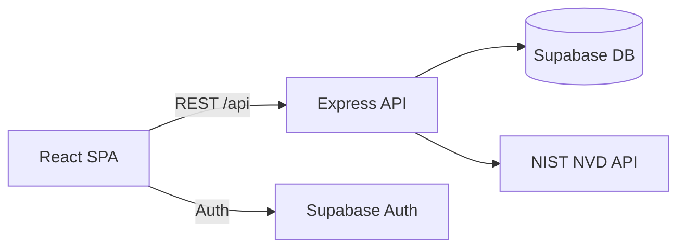

# Vulnerability Tracker

A full-stack web app that helps developers monitor **CVE vulnerabilities** for technologies in their stack. Instead of searching the [NIST NVD](https://nvd.nist.gov/) manually, you build a personal watchlist and browse severity-ranked advisories on one dashboard.

**Live demo:** [https://inst-377-project-final-philip-montv.vercel.app/](https://inst-377-project-final-philip-montv.vercel.app/)

## Screenshots

> After deploying the latest UI, add `login.png`, `dashboard.png`, and `about.png` to [`docs/screenshots/`](docs/screenshots/). See [docs/screenshots/README.md](docs/screenshots/README.md) for capture specs.

| Login | Dashboard |
|-------|-----------|
| Split product + auth layout with live CVE preview | Advisory feed with CVSS severity, stats bar, and NVD integration |

| About |
|-------|
| Problem → approach → try it flow with tech stack badges |

## Highlights

- **Live NVD integration** — queries NIST CVE API 2.0 with CPE-aware matching
- **Supabase Auth** — email/password login with persistent sessions
- **Personal watchlist** — track up to 5 technologies, validated against NVD
- **Severity-ranked dashboard** — CVSS badges, advisory carousels, highest-risk summary
- **Polished UI** — loading skeletons, hover states, responsive layout
- **REST API** — Express backend with Supabase Postgres

## Tech stack

| Layer | Technologies |
|-------|----------------|
| Frontend | React 19, Vite, Swiper |
| Backend | Node.js, Express 5 |
| Data & auth | Supabase |
| External API | NIST NVD CVE API 2.0 |
| Deployment | Vercel |

## Architecture

## Quick start

1. Clone the repo and run `npm install`.
2. Copy [.env.example](.env.example) to `.env` and add your keys.
3. Start two terminals:
   - `npm run dev` — Vite frontend (proxies `/api` to port 3000)
   - `npm run server` — Express backend
4. Open the Vite dev URL (usually `http://localhost:5173`).

For API endpoints, manual testing steps, and known limitations, see [docs/README.md](docs/README.md).

## Environment variables

| Variable | Purpose |
|----------|---------|
| `VITE_SUPABASE_URL` | Supabase project URL (frontend) |
| `VITE_SUPABASE_KEY` | Supabase anon key (frontend) |
| `SUPABASE_SERVICE_ROLE_KEY` | Supabase service role (backend) |
| `NVD_API_KEY` | [NIST NVD API key](https://nvd.nist.gov/developers/request-an-api-key) |

## Team

**Ishan Rajan** and **Philip Montvillo** — INST377 Final Project, University of Maryland.

## License

ISC
